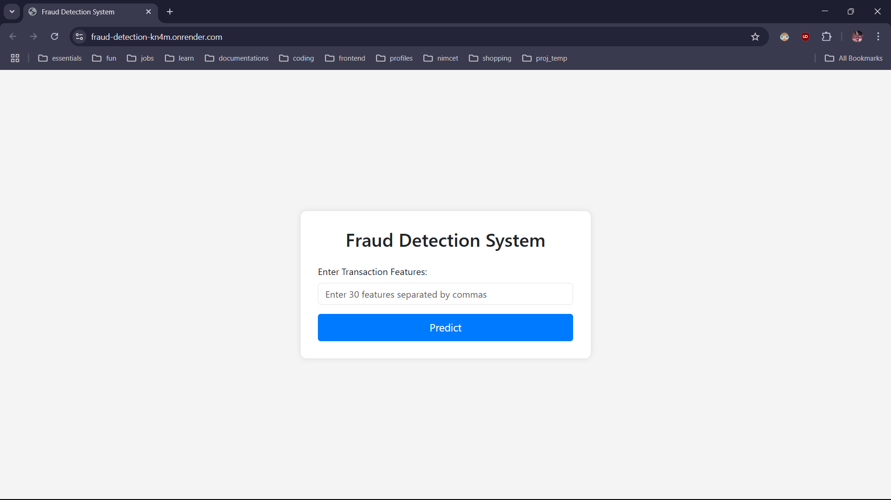
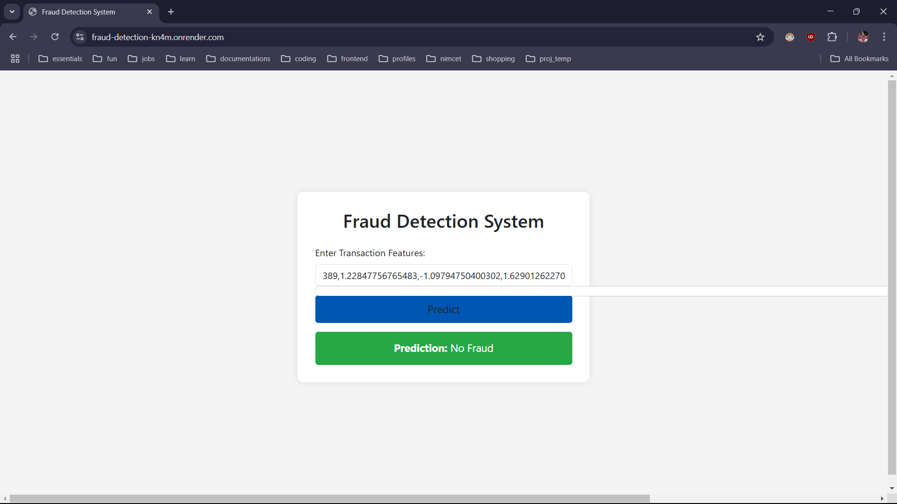
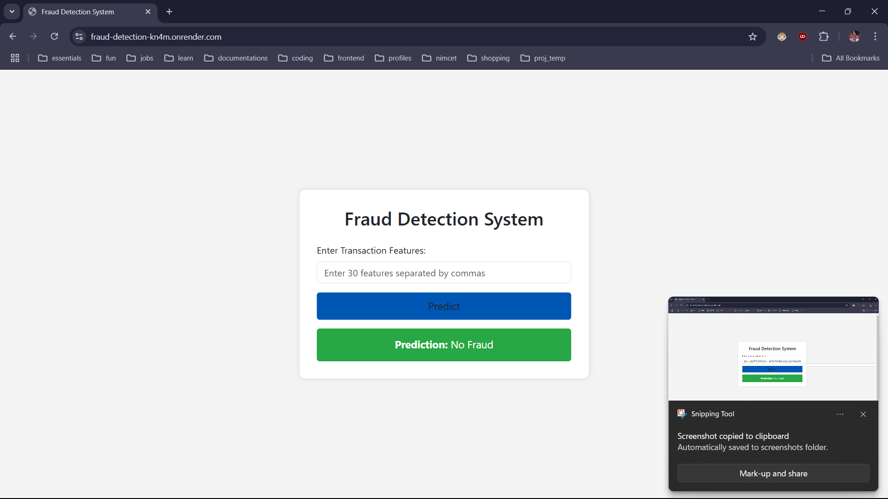

# 🚀 Fraud Detection System

# Render webservice OUTPUTS





## 📌 Project Overview
This is a **Machine Learning-based Fraud Detection System** that predicts whether a credit card transaction is fraudulent or not. The system is built using **Flask** for the web interface and **Scikit-learn** for the ML model.

## 📊 Dataset
- **Source:** Kaggle - [Credit Card Fraud Detection Dataset](https://www.kaggle.com/mlg-ulb/creditcardfraud)
- **Description:** The dataset contains credit card transactions labeled as fraudulent or non-fraudulent.
- **Features:** 30 numerical features derived from PCA transformation.

## 🎯 Goals
- Train a **classification model** to detect fraudulent transactions.
- Deploy the model using **Flask**.
- Create a **user-friendly web interface** for input and output.

## 🛠 Tech Stack
- **Python** (Numpy, Pandas, Scikit-learn, Joblib)
- **Flask** (Backend Framework)
- **HTML/CSS & JavaScript** (Frontend UI)
- **Gunicorn** (Production WSGI Server)
- **Render** (For Deployment)

## 📂 Project Structure
```
fraud-detection/
│── templates/           # HTML templates
│   ├── index.html       # Main UI
│── fraud_model.pkl  # Trained model
│── app.py               # Flask application
│── main.ipynb           # Data preprocessing and model building
│── requirements.txt     # Dependencies
│── Procfile             # Deployment configuration
│── README.md            # Project Documentation
```

## 🔥 Installation & Setup
1️⃣ **Clone the repository**
```bash
git clone https://github.com/Akshzz-16/fraud-detection.git
cd fraud-detection
```

2️⃣ **Create a virtual environment**
```bash
python -m venv venv
source venv/bin/activate   # On macOS/Linux
venv\Scripts\activate     # On Windows
```

3️⃣ **Install dependencies**
```bash
pip install -r requirements.txt
```

4️⃣ **Run the Flask App**
```bash
python app.py
```
Access the app at: `http://127.0.0.1:5000/`

## 🚀 Deployment (Render)
1️⃣ **Push the project to GitHub**
```bash
git add .
git commit -m "Initial commit"
git push origin main
```

2️⃣ **Deploy on Render**
- Go to [Render.com](https://render.com/)
- Create a **new Web Service**
- Connect your **GitHub repo**
- Set **Build Command**: `pip install -r requirements.txt`
- Set **Start Command**: `gunicorn app:app`
- Click **Deploy** 🎉

## 🎯 Usage
1. Enter the transaction details as **comma-separated values**.
2. Click **Predict**.
3. Get instant results: **Fraud** or **Not Fraud**.

## 🤝 Contribution
Contributions are welcome! Feel free to **fork** the repo, create a new branch, and submit a PR.

## 📜 License
This project is open-source and available under the **MIT License**.

---
**🔗 Author:** Akash Vishwakarma    
**📧 Contact:** akashxjr10vishwakarma@gmail.com  
**🌟 GitHub:** [Akshzz-16](https://github.com/Akshzz-16)

